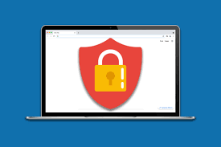

# Cách truy cập trang web bị chặn: giải pháp đơn giản ai cũng làm được

## Vì sao trang web bị chặn?

Chắc hẳn nhiều lần bạn muốn truy cập một trang web nào đó nhưng lại nhận được thông báo không thể vào hoặc bị chặn. Nguyên nhân phổ biến là do nhà mạng, tổ chức quản lý mạng hoặc chính trang web đó hạn chế truy cập theo vùng miền hoặc do chính sách bảo mật. Điều này gây không ít phiền toái, đặc biệt khi bạn cần xem phim, tìm tài liệu hay sử dụng dịch vụ trực tuyến bị giới hạn.

**[️🛒️🛒Mua Proxy Ngay](https://9proxy.com/pricing)**

## Mình đã làm thế nào để “vượt rào”?

Sau khi thử nhiều cách như đổi DNS, sử dụng VPN, mình nhận thấy proxy là phương án hiệu quả nhất. Proxy giúp ẩn địa chỉ IP thật của mình và giả lập truy cập từ một quốc gia khác. Nhờ đó, mình dễ dàng truy cập các trang web bị chặn mà không gặp phải rào cản nào, tốc độ nhanh và ổn định.

## Proxy của **9Proxy** – trợ thủ đắc lực cho mình

Sau khi dùng thử nhiều dịch vụ, mình chọn **[9proxy](https://9proxy.com)** vì tốc độ ổn định, ít bị lag và có rất nhiều IP từ nhiều quốc gia khác nhau để lựa chọn. Dịch vụ dễ dùng, phù hợp cả với người mới bắt đầu và giúp mình truy cập mọi trang web bị chặn mà không gặp gián đoạn. Ngoài ra, **9Proxy** còn giúp bảo mật thông tin cá nhân khi online, nên rất yên tâm khi sử dụng.

## Lời khuyên cho bạn

Nếu bạn đang tìm “cách truy cập trang web bị chặn” đơn giản và hiệu quả, mình khuyên bạn nên thử ngay **[9proxy](https://9proxy.com)**. Đây là giải pháp nhanh nhất giúp bạn mở rộng trải nghiệm trên internet, truy cập mọi nội dung mình muốn dù ở bất kỳ đâu.

Mở rộng mạng lưới internet của bạn ngay bây giờ với **[9proxy](https://9proxy.com)** và nhận ưu đãi cực “hời”!

---

